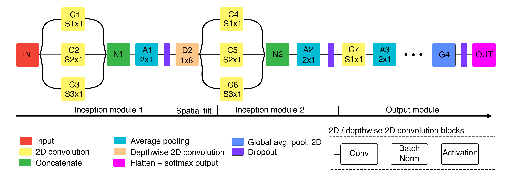

# EEG-InceptionGen

## Presentación

Este es el repositorio principal de la comunicación del XXXIX Congreso Anual de 
la Sociedad de Ingeniería Biomédica presentada por Eduardo Santamaría-Vázquez,
Sergio Pérez-Velasco, Victor Martínez-Cagigal y Roberto Hornero.

## Contenido del repositorio
En el archivo EEGInceptionGen se encuentra la clase principal del modelo
presentado en la comunicación, una red convolucional multipropósito para 
clasificación de señales EEG. EN el se definen todos los parámetros de entrada 
así como los valores por defecto usados para el estudio. En la siguiente figura 
se encuentra una representación esquemática de la arquiectura de EEG-InceptionGen

